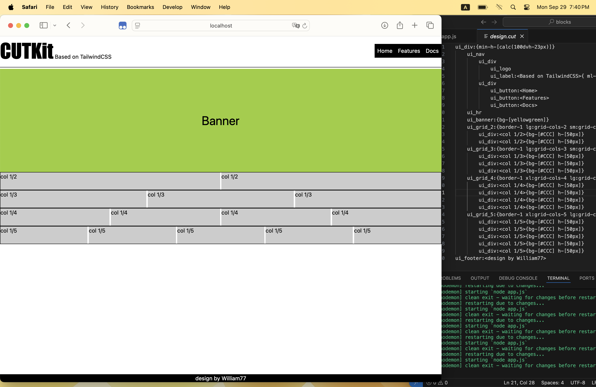

# cutkit

這是一套切版輔助工具
目標使用者是切版師 - 建議是網頁設計師處理，確保設計稿與最後視覺產出一致，減少設計師與前端工程師溝通成本
透過本程式可以輕鬆建構視覺版面的程式碼供前端程式設計師使用

首先我們需要安裝 nodemon
npm i -g nodemon
確認安裝好後，執行 nodemon app.js
請安裝好 VSCode 的外掛 Live Server
開啟 Live Server 即可預覽畫面

先了解專案結構
component 資料夾為切版師自定義的元件，為片段的 html 程式，可覆用
design 資料夾存放 .cut 設計程式稿
output 資料夾存放編譯後的成品，若設計稿為 my-page.cut，則輸出的完成稿為 my-page.html
app.js 為編譯 .cut (design 資料夾內) 的核心程式，可轉換 .cut 為 .html(output 資料夾內)
nodemon.json 為 nodemon 軟體的 config 檔，可視需求修改，一般而言不需要更改

以設計稿 deisgn.cut 為例
其中一個元件是 ui_label，ui_label 定義在 component 資料夾的 ui_label.html

ui_label.html內定義如下
{{}}
ui_label.html 的內容最外層的標籤一定要加上 class=""，
即便沒有設置 class，也要撰寫 <xxx class=""></xxx>

而 {{}} 代表可以安插子元件，

⭐️ 實際範例 1 
譬如 <xxx class="inline-flex">{{}}</xxx>
設計稿 .cut 內可以這樣寫
ui_label:<Based on TailwindCSS>
Based on TailwindCSS的文字會取代 {{}}

⭐️ 實際範例 2
若非文字元素而是定義好的元件
設計稿 .cut 內可以這樣寫
ui_div
    ui_label:<string1>
    ui_label:<string2>
則 ui_div 的 {{}} 會轉成 2 個 label 的內容
記得樹狀結構的設計前方需要 4 個 space，4, 8, 12 ... 依此類推

design.cut 的部分取下面片段解釋
ui_label:<Based on TailwindCSS>{ ml-1 }

ui_label => 新增 label 元件
ui_label:<Based on TailwindCSS> => 新增 label 元件，文字內容為 Based on TailwindCSS
ui_label:<Based on TailwindCSS>{ ml-1 } => 新增 label 元件內容為 Based on TailwindCSS 並增加 tailwind 樣式

你也可以自己設計元件譬如 my_label，
my_label.html 可自行定義內容，
最後在 .cut 新增你設計好的元件

如果你喜歡這套程式並且願意分享好您設計的元件，我可以將你的元件合併到我的 component 資料夾內 ;-)